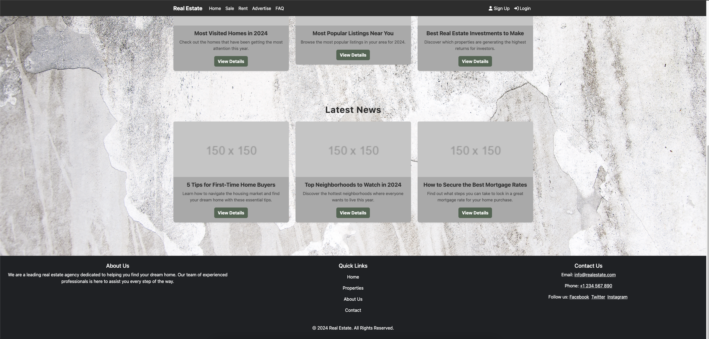
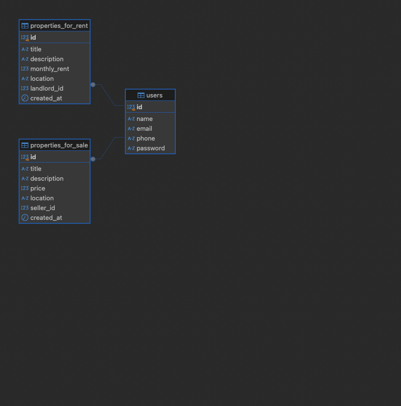

# RealEstateProject

## Overview
A full-stack real estate application to browse and advertise properties for sale or rent. The project includes:

- **Frontend**: Built with React and Vite.
- **Backend**: Built with Node.js, Express, and PostgreSQL.

> **Note**: This project is under active development.

---

### Project Screenshots

#### Homepage Screenshot 1


#### Homepage Screenshot 2


#### Sales Page Screenshot


#### Database ER Diagram


---

### Project Structure

#### Frontend
Contains the React application for the user interface. Located in the `/frontend` directory.

#### Backend
Contains the Express server and API logic for handling property listings. Located in the `/backend` directory.

---

### Future Enhancements
- Add authentication and user accounts.
- Improve UI and UX for property listings.
- Enable property posting directly from the frontend.
- Expand database functionality.

---

### Requirements
- **Node.js** (v22.11.0 or higher recommended)
- **PostgreSQL** (for database)

---

### Setup Instructions

#### Clone the Repository:

```bash
git clone https://github.com/your-username/RealEstateProject.git
cd RealEstateProject
```

---

#### Backend Setup:

1. Navigate to the backend folder:
   ```bash
   cd backend
   ```  
2. Install dependencies:
   ```bash
   npm install
   ```
3. Create a .env file in the /backend directory and include your database credentials:
    DB_USER=your_db_username
    DB_HOST=your_db_host
    DB_NAME=your_db_name
    DB_PASSWORD=your_db_password
    DB_PORT=your_db_port
    
4. Start the backend server in development mode:
   ```bash
   npm run dev  
   ```
---

#### Frontend Setup:

1. Navigate to the frontend folder:
   ```bash
   cd ../frontend
   ```
2. Install dependencies:
   ```bash
   npm install
   ```
3. Start the frontend development server:
   ```bash
   npm run dev
   ```
4. Open your browser and visit `http://localhost:5173` to access the frontend.

---

### APIs

The backend exposes the following API endpoints:

- `GET /api/properties/sale`: Fetch all properties for sale.
- `GET /api/properties/rent`: Fetch all properties for rent.

---

### Database Setup

To run the backend, you must create a PostgreSQL database with the following structure:

#### Tables

##### `users`
- `id`: Primary key.
- `name`: User's full name.
- `email`: User's email address.
- `phone`: User's phone number.
- `password`: User's hashed password.

##### `properties_for_rent`
- `id`: Primary key.
- `title`: Title of the property listing.
- `description`: Description of the property.
- `monthly_rent`: Monthly rent amount.
- `location`: Property location.
- `landlord_id`: Foreign key referencing the users table.
- `created_at`: Timestamp when the property was listed.

##### `properties_for_sale`
- `id`: Primary key.
- `title`: Title of the property listing.
- `description`: Description of the property.
- `price`: Sale price of the property.
- `location`: Property location.
- `seller_id`: Foreign key referencing the users table.
- `created_at`: Timestamp when the property was listed.

---